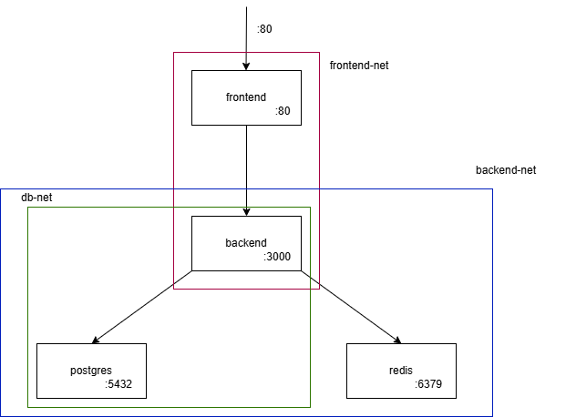

# Instalacja
1. Należy sklonować repo
2. W katalogu wywołać komendę ```docker compose up -d```


# Architektura



Projekt używa czterech usług:
- frontend, działający na nginxie, pozwala na otwarcie strony
- backend, przechowuje server Express
- postgres
- redis

Można potwierdzić ich istnienie za pomocą ```docker compose config --services```

Linki do obrazów:
- [frontend](https://hub.docker.com/repository/docker/wkwidzinski/projekt-frontend)
- [backend](https://hub.docker.com/repository/docker/wkwidzinski/projekt-backend)


API zawiera 3 endpointy: GET "/items" do pobrania danych, POST "/items" do dodania danych i "/health" do sprawdzenia stanu api, redisa i postgresa. Do potwierdzenia ich działania można wywołać odpowiednie polecenia curl


GET "/items" ```curl http://localhost/api/items```

POST "/items" ```curl http://localhost/items -H "Content-Type: application/json" -d '{"name":"Minecraft"}'```

GET "/health" ```curl http://localhost/api/health```